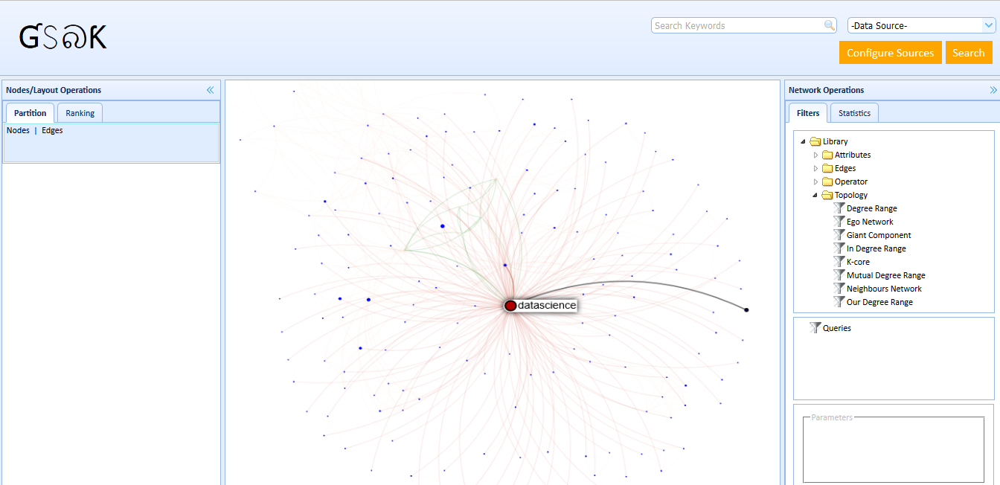

# gephi-swiss-army-knife
The purpose of this project is to provide a simple and interactive web based platform for visualization, inspired by [Gephi](https://gephi.org/) 

  
     

### Purpose
The purpose of this project is to provide a simple and interactive platform for visualization.

### License
The code is licensed using the [Apache License Version 2.0](http://www.apache.org/licenses/LICENSE-2.0).

[Roadmap](https://github.com/project-spinoza/gephi-swiss-army-knife/wiki/Roadmap)
