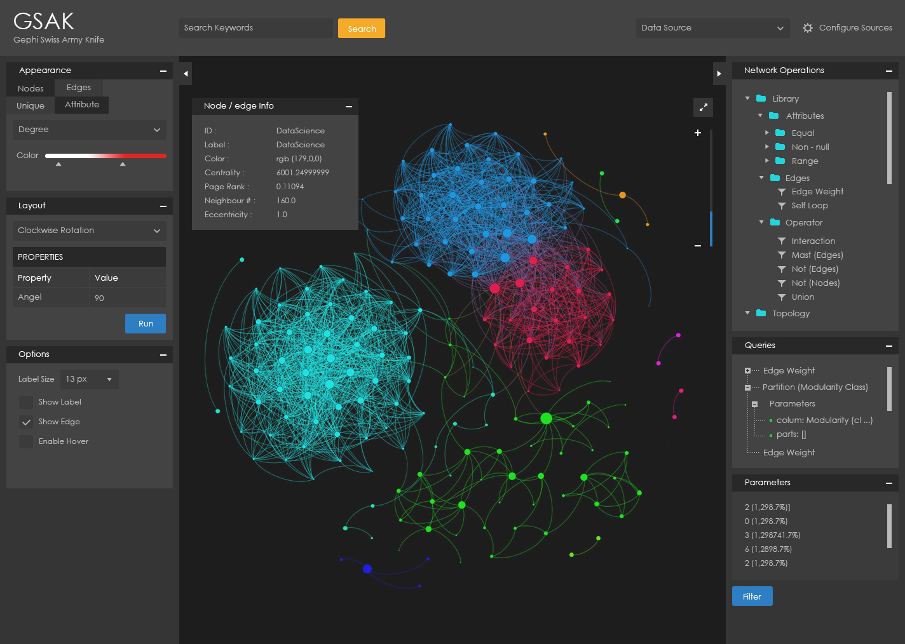

# gephi-swiss-army-knife
The purpose of this project is to provide a simple and interactive web based graph analysis and visualization platform, inspired by [Gephi](https://gephi.org/) 

</img> `we are on it!!!`

 

     

### Purpose
The purpose of this project is to provide a simple and interactive web based graph analysis and visualization platform, inspired by [Gephi](https://gephi.org/) 

### Prerequisites
Download and install maven [- download](https://maven.apache.org/download.cgi)

### Clone the repository
Run the following command 
`git clone https://github.com/project-spinoza/gephi-swiss-army-knife.git`
 OR 
Download zip file [- download](https://github.com/project-spinoza/gephi-swiss-army-knife/archive/master.zip)

### Build
* Enter the following command from the root directory of the repsository 
  `mvn clean install`

### Run
* Run `startup.sh` linux/mac
* Run `startup.bat` windows
 OR 
* Run `java -jar target/gephi-swiss-army-knife-1.0.0-jar-with-dependencies.jar sample.gexf`
* navigate to `localhost:9090/graph`

 

### Note
the project is under development

 
### License
The code is licensed using the [Apache License Version 2.0](http://www.apache.org/licenses/LICENSE-2.0).

[Roadmap](https://github.com/project-spinoza/gephi-swiss-army-knife/wiki/Roadmap)
