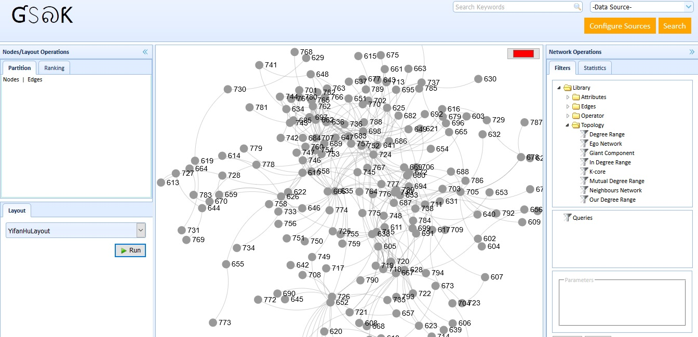
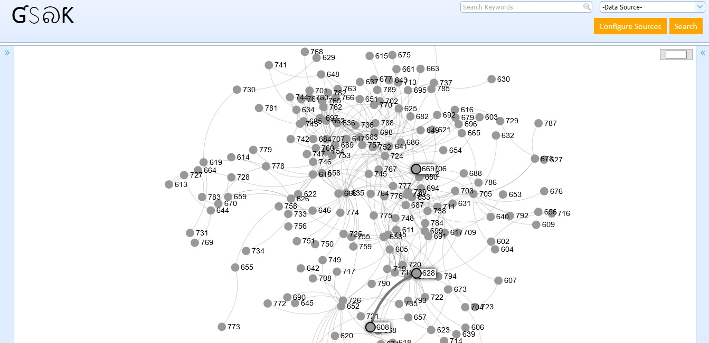

# gephi-swiss-army-knife
The purpose of this project is to provide a simple and interactive web based platform for visualization, inspired by [Gephi](https://gephi.org/) 

  
     
     

### Purpose
The purpose of this project is to provide a simple and interactive web based platform for visualization, inspired by [Gephi](https://gephi.org/) 

### Build
* Enter the following comman from the root directory of the gephi-swiss-army-knife 
  `mvn clean install`

### Run
* Run `startup.sh` linux/mac
* Run `startup.bat` windows
 OR 
* Run `java -jar target/gephi-swiss-army-knife-1.0.0-jar-with-dependencies.jar sample.gexf`
* navigate to (localhost:9090/graph)

 

### License
The code is licensed using the [Apache License Version 2.0](http://www.apache.org/licenses/LICENSE-2.0).

[Roadmap](https://github.com/project-spinoza/gephi-swiss-army-knife/wiki/Roadmap)
